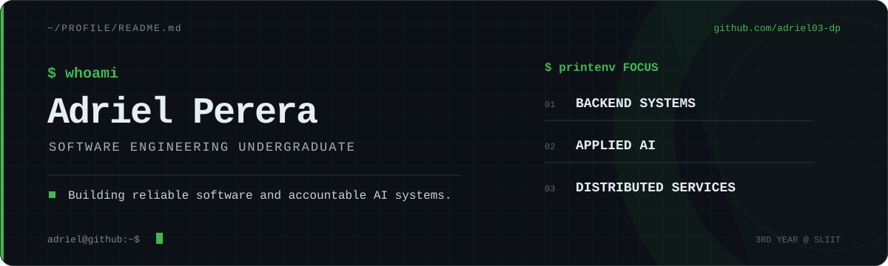
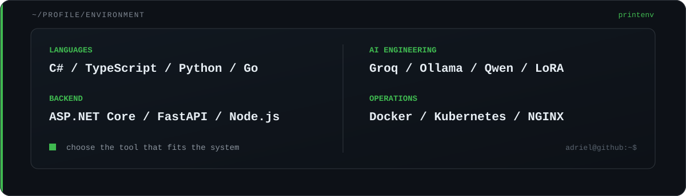

  

  <a href="mailto:adrielp2000@gmail.com">Email</a> &nbsp;|&nbsp;
  <a href="https://www.linkedin.com/in/adriel-perera">LinkedIn</a> &nbsp;|&nbsp;
  <a href="https://github.com/adriel03-dp?tab=repositories">Repositories</a>

## `$ whoami`

Software Engineering undergraduate building dependable backend systems and practical AI tools. I work across APIs, distributed services, model integration, testing, and deployment.

## `$ printenv ENGINEERING_STACK`

  

## `$ github-metrics --summary`

  

## `$ echo $CONTACT`

Open to internships, junior engineering roles, and technical collaborations.

[Email](mailto:adrielp2000@gmail.com) | [LinkedIn](https://www.linkedin.com/in/adriel-perera) | [Repositories](https://github.com/adriel03-dp?tab=repositories)
