<p align="center">
  
</p>

<p align="center">
  <a href="mailto:adrielp2000@gmail.com">Email</a> |
  <a href="https://www.linkedin.com/in/adriel-perera">LinkedIn</a> |
  <a href="https://github.com/adriel03-dp?tab=repositories">Repositories</a>
</p>

# `$ whoami`

```text
name      Adriel Perera
role      3rd Year Software Engineering Undergraduate @ SLIIT
focus     Backend systems, applied AI, and distributed services
status    Building, testing, and looking for engineering opportunities
```

## `$ cat about.txt`

I build software around the boundaries where systems usually become difficult: API contracts, state transitions, persistence, authentication, failure handling, and model integration.

My current work spans deterministic backend services, full-stack applications, microservice workflows, data-quality tooling, and small-model experimentation. I learn by implementing the system, testing the critical behavior, and documenting the decisions that make it reliable.

## `$ ls ./projects --sort=engineering-depth`

### [Decision Replay](https://github.com/adriel03-dp/decision_replay)

> `system:` constraint-based decision engine <br />
> `stack:` ASP.NET Core 8, C#, MongoDB, Next.js 16, TypeScript, Groq, Ollama, xUnit

Transforms natural-language decisions into structured, replayable analysis. Language models handle field extraction and explanation, while deterministic .NET services own validation, weighted scoring, risk classification, recommendations, plans, and version comparisons.

**Engineering signal:** provider-neutral AI integration, layered backend boundaries, JWT-protected APIs, audit trails, health checks, PDF/XLSX exports, and tests for scoring, replay, and planning behavior.

### [AI Telemedicine Microservices System](https://github.com/AseshNemal/AI-Telemedicine-Microservices-System)

> `system:` collaborative telemedicine platform <br />
> `stack:` Node.js, Express, Go, Gin, MongoDB, Next.js, NGINX, Docker, Kubernetes

Coordinates authentication, patient, doctor, appointment, notification, payment, and symptom-assessment services behind a single API gateway.

**My contribution:** strengthened doctor, appointment, and payment workflows through role-based authorization, service-to-service validation, MongoDB indexing, atomic booking and payment changes, Stripe webhook verification, refunds, and error handling.

### [CleanDataPro](https://github.com/adriel03-dp/clean-datapro)

> `system:` auditable CSV cleaning workflow <br />
> `stack:` Python, FastAPI, Pandas, MongoDB, Flask, pytest, ReportLab

Processes uploaded CSV datasets, applies explicit cleaning rules, records before-and-after quality information, and returns cleaned data with machine-readable and PDF reports.

**Engineering signal:** separated API and web layers, JWT authentication, per-user processing history, artifact downloads, structured logging, deployment configuration, and tests for the cleaning and reporting paths.

### [Sinhala Transcript Correction Lab](https://github.com/adriel03-dp/Qwen3_1.7B-Unified-)

> `system:` parameter-efficient language-model experiment <br />
> `stack:` Qwen3-1.7B, Python, PyTorch, Transformers, TRL, PEFT, LoRA

Explores Sinhala transcript and text correction with a structured prompt-completion dataset and a LoRA training pipeline.

**Engineering signal:** dataset schema checks, duplicate detection, label validation, review gates, phrase-group split isolation, balanced training records, deterministic generation, and explicit hardware checks.

## `$ printenv TECH_STACK`

| Environment | Verified tools |
| --- | --- |
| **Languages** | `C#` `TypeScript` `Python` `Go` `JavaScript` |
| **Backend and APIs** | `ASP.NET Core` `FastAPI` `Node.js` `Express` `Gin` `REST` `OpenAPI` |
| **Frontend** | `Next.js` `React` `Tailwind CSS` `Flask` |
| **AI engineering** | `Groq` `Ollama` `Qwen` `Transformers` `TRL` `PEFT` `LoRA` |
| **Data and persistence** | `MongoDB` `Pandas` |
| **Testing and operations** | `xUnit` `pytest` `Docker` `Kubernetes` `NGINX` `JWT` |

## `$ cat engineering-principles.md`

```text
[ENGINEERING PRINCIPLES]
├── Keep probabilistic model output outside deterministic business rules
├── Validate requests, data, and identity at system boundaries
├── Make important state changes replayable or auditable
├── Test critical decisions and transformations
├── Expose failures through clear errors, logs, and health checks
└── Prefer replaceable providers and explicit interfaces
```

## `$ echo $CONTACT`

I am open to internships, junior engineering roles, and collaborations involving backend systems, applied AI, or distributed software.

`mail` [adrielp2000@gmail.com](mailto:adrielp2000@gmail.com) <br />
`link` [linkedin.com/in/adriel-perera](https://www.linkedin.com/in/adriel-perera)

```text
adriel@github:~$ exit 0
```
